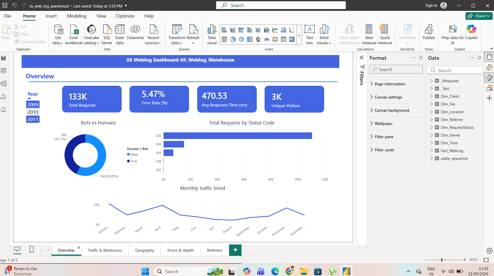
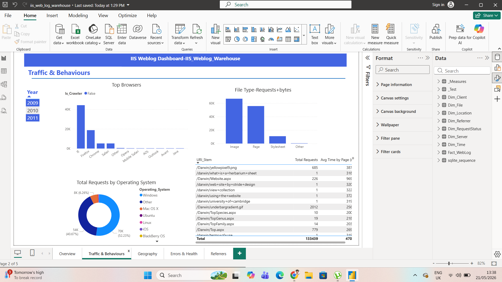
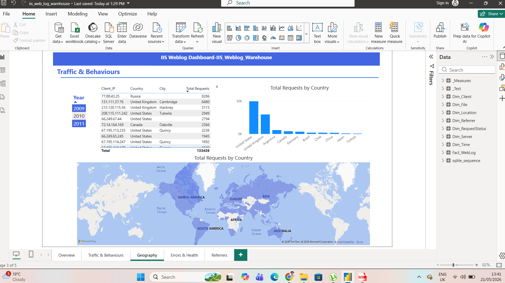
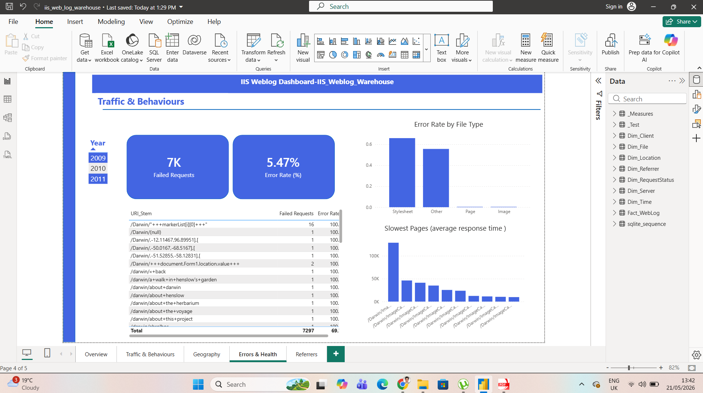
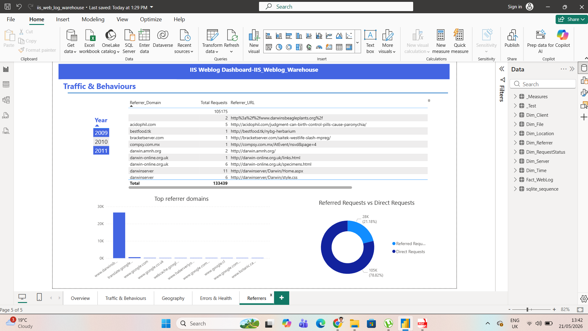

# IIS Web-Log Data Warehouse + Power BI Dashboard

End-to-end analytics pipeline that turns raw IIS web-server logs into a queryable star-schema warehouse and a Power BI dashboard.


## What this project demonstrates

| Skill | Detail |
|-------|--------|
| Data engineering | Python ETL pipeline — 4 stages, resumable |
| Dimensional modelling | 1 fact + 7 dimension star schema in SQLite |
| Geo enrichment | MaxMind GeoLite2-City — 4,010 unique IPs |
| UA parsing | Browser, OS, crawler detection |
| Business Intelligence | Power BI dashboard with DAX measures |
| Software craft | Modular package, env-driven config, Git |

## Dataset

93 real IIS log files from the Darwin's Beagle Plants website (2009–2011):
- **154,463** HTTP requests
- **4,010** unique client IPs
- **9.8%** overall error rate
- **43.6%** bot traffic (Googlebot, Yahoo Slurp, YandexBot)

## Architecture
Raw IIS .log files → Stage 1: Parse → Stage 2: GeoIP → Stage 3: UA Parse → Stage 4: SQLite Star Schema → Power BI

## Power BI Dashboard

### Overview


### Traffic & Behaviours



### Geography


### Errors & Health


### Referrers


## Quick start

```bash
git clone https://github.com/Bahrami87/iis-weblog-warehouse.git
cd iis-weblog-warehouse
python -m venv .venv && .venv\Scripts\activate
pip install -r requirements.txt
python -m src.pipeline
```

## Tech stack

- Python 3.10+ · pandas · geoip2 · user-agents
- SQLite (star schema warehouse)
- Power BI Desktop + DAX
- MaxMind GeoLite2-City

## License

MIT